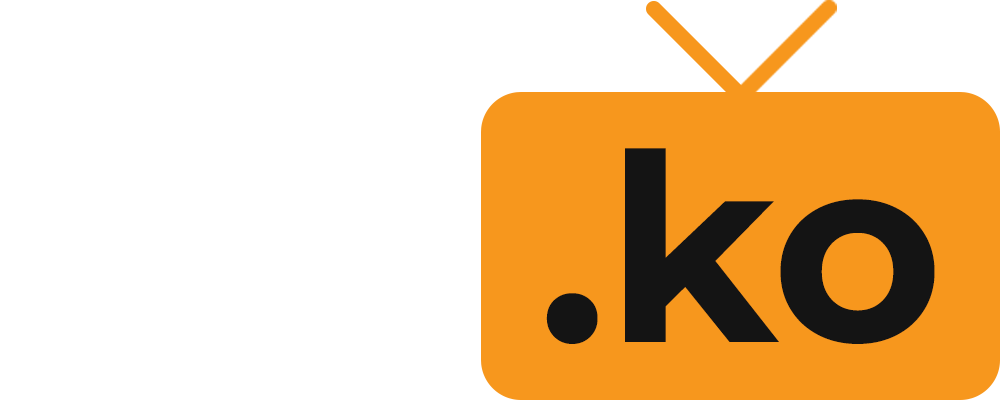
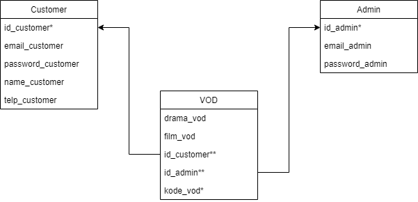

<!-- Logo Proyek -->
 

  

  <h3 align="center">ntn.ko</h3>

  

    On-Demand Korean Streaming Website
  

<!-- Daftar Isi -->

  
<h2 style="display: inline-block">Daftar Isi</h2>

  <ol>
    <li><a href="#anggota-tim">Anggota Tim</a></li>
    <li><a href="#fungsi">Fungsi</a></li>
    <li><a href="#tujuan">Tujuan</a></li>
    <li><a href="#target-pengguna">Target Pengguna</a></li>
    <li><a href="#mockup-kasar">Mockup Kasar</a></li>
    <li><a href="#skema-database">Skema Database</a></li>
  </ol>

<!-- Anggota Tim -->
## Anggota Tim
| NPM           | Name        |
| ------------- |-------------|
| 140810200022  | Osmond Haylim    |
| 140810200024  | Jonathan Victor Goklas    |
| 140810200064  | Muhammad Ariiq Rakha Shafa   |

<!-- Fungsi -->
## Fungsi

Sebagai Platform bagi para pecinta entertainment Korea dengan menyediakan berbagai Drama dan Film Korea berbahasa Indonesia.

<!-- Tujuan -->
## Tujuan

Memenuhi tugas project praktikum pemrograman web serta untuk dikembangkan lagi dikemudian hari.

<!-- Target Pengguna -->
## Target Pengguna

Pecinta film dan drama korea.

<!-- Mockup Kasar -->
## Mockup Kasar

Gambar mockup di sini atau [link figma](https://www.figma.com/file/i0qXfGOCSH8dwJtlADWlym/xXxOJRxXx-Mockup?node-id=0%3A1).

<!-- Skema Database -->
## Skema Database

